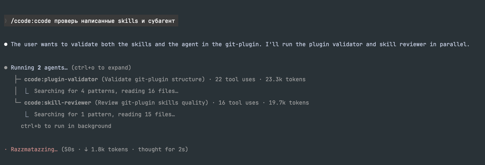

# ccode

Claude Code plugin for creating skills, agents, hooks, MCP integrations, plugins, and marketplaces with guided
workflows, validation, documentation knowledge, and review agents.



## Installation

```
/plugin marketplace add aiclaudelib/marketplace
/plugin install ccode@aiclaudelib
```

## Usage

Single entry point for all plugin development tasks:

```
/ccode create a plugin for code linting
/ccode create a skill that formats markdown
/ccode create an agent for database queries
/ccode create a PreToolUse hook for Bash validation
/ccode how do MCP servers work in plugins?
/ccode what is the plugin.json manifest schema?
/ccode how do plugin settings (.local.md) work?
/ccode how do I create a plugin marketplace?
```

The `/ccode` command routes your request to the appropriate specialist agent automatically.

Claude also auto-invokes internal skills when relevant — saying "create a Claude Code hook" in conversation works
without explicitly using `/ccode`.

## Architecture

```
/ccode "user request"
   │
   └── master agent (router)
          │
          ├── reads internal skill workflow
          │
          └── delegates via Task tool
                 ├── docs-guide        → Q&A, MCP, settings, structure, marketplaces
                 ├── plugin-architect   → plugin & agent creation
                 ├── skill-expert       → skill creation
                 ├── hook-expert        → hook creation
                 ├── plugin-validator   → plugin validation
                 └── skill-reviewer     → skill quality review
```

## Structure

```
ccode/
├── .claude-plugin/
│   └── plugin.json            # Plugin manifest
├── skills/
│   ├── ccode/                 # User-facing entry point (/ccode)
│   │   └── SKILL.md
│   ├── ask/                   # Internal: knowledge Q&A
│   ├── create-plugin/         # Internal: plugin scaffolding (8-phase workflow)
│   ├── create-skill/          # Internal: skill scaffolding
│   ├── create-agent/          # Internal: agent scaffolding
│   ├── create-hook/           # Internal: hook scaffolding
│   ├── mcp-integration/       # Internal: MCP server guidance with references
│   ├── plugin-settings/       # Internal: plugin settings guidance with references
│   ├── plugin-structure/      # Internal: plugin structure guidance with references
│   └── plugin-marketplaces/   # Internal: marketplace guidance with references
├── agents/
│   ├── master.md              # Central router
│   ├── docs-guide.md          # Documentation router
│   ├── hook-expert.md         # Hook & automation specialist
│   ├── plugin-architect.md    # Plugin lead architect
│   ├── plugin-validator.md    # Plugin structure and component validator
│   ├── skill-expert.md        # Skill authoring specialist
│   └── skill-reviewer.md      # Skill quality reviewer
├── hooks/
│   └── hooks.json             # Validation hooks config
├── knowledge/                 # Documentation files
├── scripts/
│   ├── clean-knowledge.sh     # Knowledge file cleanup
│   ├── hook-linter.sh         # Lint hooks.json for common issues
│   ├── parse-frontmatter.sh   # Extract YAML frontmatter fields from markdown
│   ├── test-hook.sh           # Test hook scripts with simulated events
│   ├── validate-agent.sh      # Validate agent markdown files
│   ├── validate-hooks-json.sh # Validate hooks.json structure
│   ├── validate-settings.sh   # Validate .local.md settings files
│   └── validate-skill-frontmatter.sh  # Validate skill SKILL.md frontmatter
└── README.md
```

## License

[MIT](LICENSE)
